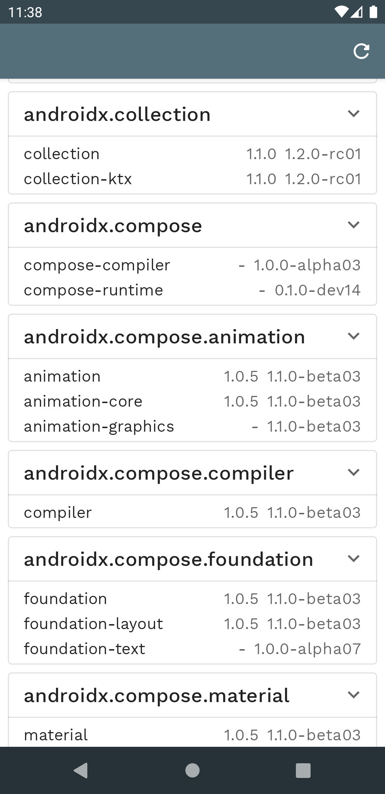

# Library Tracker
An App that fetch and notify when there is a change in bookmarked Android Library.
 
 

## Features
- [X] Automatically refresh when App is opened
  - Only once in a day, so bandwidth is not wasted
  - Shows Notification when Fetching
- [X] Force Refresh on Command
- [ ] Ability to Bookmark Libraries
  - Notify if any new version of Bookmarked Library is available
- [ ] Ability to Refresh Periodically
  - Can be turned On/Off by User

## About Architecture and Code
* Follows Clean Android Architecture (https://developer.android.com/jetpack/guide)
* Follows MVVM (Model View ViewModel) Architecture
* Follows Test Driven Development (TDD)
* Follows Agile Practices (Feedback Loop)
* Follows SOLID Principles
* Follows DRY and KISS
* Follows Material.Io Guide for UI Design
* Code Documents itself
* Code Follows Separation Of Concerns
* Have Unit Tests for each Class or better Unit
* Have End To End Tests
* Test tests behavior instead of implementations

## Libraries Used
* Kotlin
  - Coroutines
  - Flow
* JetPack/Arch Libraries
  - Navigation
  - DataBinding
  - DataStore
  - WorkManager
  - Room
* Dependency Injection 
  - Hilt
* Third Party
  - Material Design Components
  - Retrofit
  - ProtoBuf
* Tests
  - Junit
  - Mockito
  - Mockwebserver by okhttp3
  - Espresso
  - Uiautomator
  - Other Required Android/Kotlin Libraries like kotlinx-coroutines-test, fragment-testing etc.

## TODO
* add Github Actions CI

## More Info
see [scratchpad.txt](scratchpad.txt)
